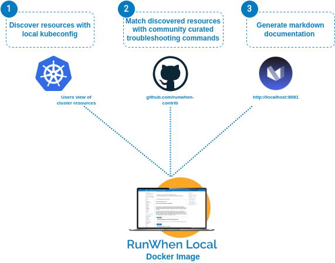

# Welcome to RunWhen Local - Troubleshooting Cheat Sheet

## Overview
This tool runs on your local machine, and:

- **Scans** your Kubernetes-based cluster
- Combines **your environment** with **community curated troubleshooting commands**
- 🎉 Generates a searchable / copy pasteable cheat sheet *tailored for the workloads you are running*

You can also *choose to upload* the configuration files to the RunWhen platform, which unlocks:

- 🔍 navigate an **interactive map** of your services, components, and troubleshooting tasks
- 🧑🏻‍🤝‍🧑🏿 collaborative troubleshooting with an **AI assistant and colleagues**
- 📈 track and alert on service issues across multiple clusters & cloud environments

## Getting Started
Documentation on getting started with RunWhen Local (and running the `workspace-builder` utility), is found here: [https://docs.runwhen.com/public/getting-started/runwhen-local](https://docs.runwhen.com/public/getting-started/runwhen-local). 

## Want to Contribute? Have an awesome troubleshooting command to share?
This tool searches the following public repositories for useful commands or runbooks that match up with the resources found in your cluster or cloud environments. 

- [RunWhen Public Codecollection](https://github.com/runwhen-contrib/rw-public-codecollection) 
- [RunWhen CLI Codecollection](https://github.com/runwhen-contrib/rw-cli-codecollection)

Feel free to open GitHub Issues to engage with our team and grow the community!

## Tool Feedback
Interested in providing feedback to help improve the tool?

- [Fill out a very short feedback form](https://docs.google.com/forms/d/e/1FAIpQLScuso8SQMdj9d-0VnxxBMcvdZrcZ2M389EbwE355flnkQOUFQ/viewform)
- [Open up a GitHub issue](https://github.com/runwhen-contrib/runwhen-local/issues/new/choose)

  
## Connect with Us
Want to connect with the RunWhen community, [join us on slack](https://runwhen.slack.com/join/shared_invite/zt-1l7t3tdzl-IzB8gXDsWtHkT8C5nufm2A)  

## Additional RunWhen Links

- [YouTube - @whatdoirunwhen](https://www.youtube.com/@whatdoirunwhen)
- [Product Documentation](https://docs.runwhen.com) 
- [Website](https://www.runwhen.com) 
- [Slack](https://runwhen.slack.com/join/shared_invite/zt-1l7t3tdzl-IzB8gXDsWtHkT8C5nufm2A)
- [LinkedIn](https://www.linkedin.com/company/runwhen/) 

## Current State of Open Source
This tool is under rapid development changes - all code will be added to this repository in a future release. Until that time, feel free to use our GitHub Issues or Slack to get in touch with us regarding changes that could support your particular use case.

## Release Notes
Short release notes are posted [here](https://docs.runwhen.com/public/runwhen-local-features/release-notes) until all code is migrated to this repository. 