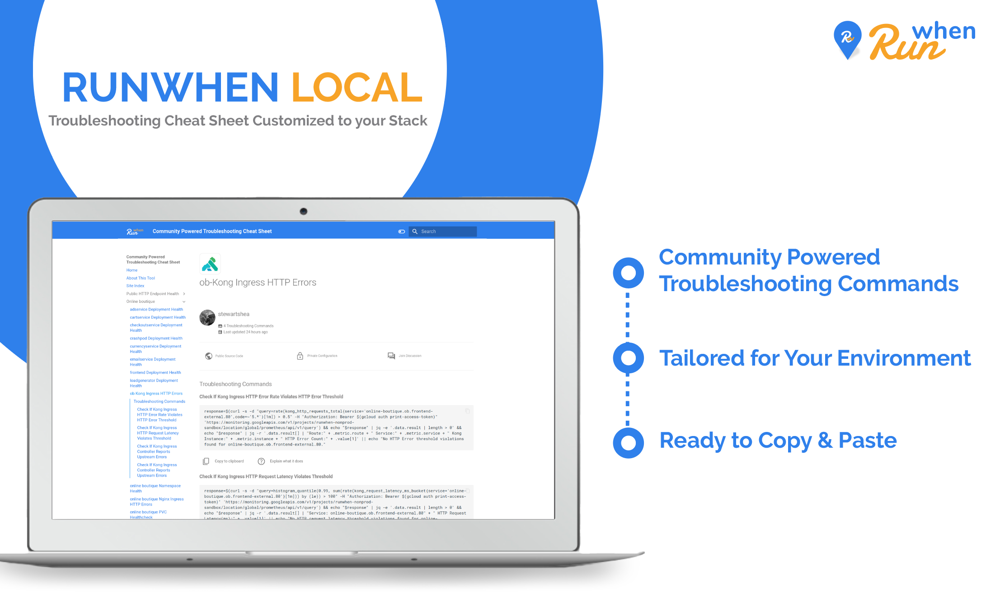

<p align="center">
  
</p>

<h1 align="center">RunWhen Local</h1>

<p align="center">
  <strong>Discover your cloud &amp; Kubernetes infrastructure and turn it into
  tailored, AI-agent-ready Skills.</strong><br>
  One image — run it standalone on your desktop with a built-in MCP server,
  or connect it to the RunWhen Platform for managed, production-grade execution.
</p>

<p align="center">
  <a href="https://runwhen.slack.com/join/shared_invite/zt-1l7t3tdzl-IzB8gXDsWtHkT8C5nufm2A"></a>
  <a href="https://opensource.org/licenses/Apache-2.0"></a>
  <a href="https://www.python.org/downloads/"></a>
  <a href="https://www.docker.com/"></a>
</p>

<p align="center">
  <a href="https://github.com/runwhen-contrib/runwhen-local">GitHub</a> ·
  <a href="https://github.com/orgs/runwhen-contrib/packages/container/package/runwhen-local">GHCR</a> ·
  <a href="https://docs.runwhen.com/public/v/runwhen-local/">Docs</a> ·
  <a href="https://runwhen-local.sandbox.runwhen.com/">Live sandbox</a>
</p>

---

> Heads up: RunWhen Local is evolving quickly. The **discovery →
> tailored Skills** workflow described below is the current core
> feature. Additional functionality is on the way and will be folded
> into this README and the docs as it lands.

## Table of Contents

- [What it does](#what-it-does)
- [Standalone vs. connected mode](#standalone-vs-connected-mode)
- [How the pieces fit together](#how-the-pieces-fit-together)
- [Quick start (standalone: local Docker + MCP)](#quick-start-standalone-local-docker--mcp)
- [Connected mode (RunWhen Platform via Helm)](#connected-mode-runwhen-platform-via-helm)
- [Configuration](#configuration)
- [What gets discovered](#what-gets-discovered)
- [Documentation](#documentation)
- [Contributing](#contributing)
- [Community and support](#community-and-support)
- [License](#license)

## What it does

1. **Discovery.** RunWhen Local connects to your Kubernetes clusters and
   cloud accounts and indexes the resources you point it at — selectively
   (per-namespace, per-resource-group) or broadly. The Azure indexer is
   native (no CloudQuery dependency) and indexes the full Azure resource
   catalog; AWS, GCP, and Kubernetes are supported.

2. **Skill tailoring.** A library of CodeBundles (in [contrib
   CodeCollections](https://github.com/runwhen-contrib)) ships
   generation rules that match against discovered resources. The
   workspace builder renders one **SLX** (a tailored Skill instance)
   per match: a runbook bound to a specific resource, with its own
   `SKILL.md` so an MCP-aware AI agent can read what it does and how to
   invoke it.

3. **Local explorer UI.** A FastAPI-backed UI at
   `http://localhost:8000/explorer/` lets you browse the discovered
   resources, the rendered SLXs, and their Skill descriptions side by
   side.

4. **Built-in MCP server.** A read-only [Model Context Protocol](https://modelcontextprotocol.io)
   server is mounted at `http://localhost:8000/mcp/` so AI agents
   (Claude Code, Cursor, Claude Desktop, ...) can search, browse, and
   read your generated Skills directly. v1 is read-only — search and
   suggestion; execution is the natural follow-on. See the
   [MCP server guide](docs/user-guide/features/mcp-server.md).

5. **Optional Platform pairing.** Push the same SLXs to the RunWhen
   Platform to gate execution behind RBAC, schedule them, and route
   results into alerts or developer self-service flows. Local is fully
   useful standalone; the Platform turns it into a production runtime.

## Standalone vs. connected mode

RunWhen Local is **one image** that runs in two modes. The discovery
engine and the generated Skills are identical in both — what changes is
*how those Skills get consumed and executed*.

| | **Standalone mode** | **Connected mode** |
| --- | --- | --- |
| **Where it runs** | Your laptop / a single Docker host | Your Kubernetes cluster (Helm) |
| **What it's for** | Free, local exploration: discover your environment and hand the pre-configured Skills to an AI agent via the **built-in MCP server**, executed from your desktop. | Production: pair with the [RunWhen Platform](https://www.runwhen.com) for scheduled, governed, audited execution. |
| **Skill execution** | You/your agent run the runbooks locally (MCP v1 is read-only: search, browse, preview). | The Platform runs SLXs behind RBAC, on a schedule, with managed secrets. |
| **Account needed** | **None.** Just Docker. | A RunWhen Platform workspace. |
| **How to install** | [`docker run` + point your MCP client at it](#quick-start-standalone-local-docker--mcp) | [Helm chart with the Runner enabled](#connected-mode-runwhen-platform-via-helm) |

**Standalone mode** is the fastest way to get value with zero
commitment: pull the image, run discovery against your cluster or cloud
account, and let Claude Code / Cursor / Claude Desktop read your tailored
Skills over MCP and help you operate your environment — all from your
desktop, for free.

**Connected mode** is the same discovery output, wired into the RunWhen
Platform so a team can run those Skills safely in production.

## How the pieces fit together

A short glossary; the [authoring/concepts
guide](docs/authoring/concepts.md) covers it in more depth.

- **CodeBundle** — a versioned, distributable unit of automation in a
  CodeCollection git repo. Ships code, optional `SKILL.md`, and one or
  more generation rules.
- **Skill** — the abstract capability the CodeBundle implements
  (e.g. "diagnose a stuck Pod", "rotate a Key Vault secret").
- **SLX** — a *rendered instance* of a Skill, bound to a specific
  resource you discovered (e.g. "diagnose a stuck Pod *in the
  `payments-prod` namespace*"). One SLX = one directory of artifacts.
- **Runbook** — the executable artifact inside an SLX (typically a
  Robot Framework `.robot`). What a human or agent actually runs.
- **Generation rule** — the YAML in a CodeBundle that tells the
  workspace builder: "match this resource type, render this Skill
  template into an SLX with this name."

```text
Discovered resources                Generated SLXs
(Kubernetes pods, Azure Key         (one per match — runbook + SKILL.md
 Vaults, AWS RDS instances, ...)     bound to a specific resource)

       │                                       │
       └──────── generation rules ─────────────┘
              (live in CodeBundles)
```

## Quick start (standalone: local Docker + MCP)

Run discovery on your desktop and hand the generated Skills to an AI
agent over the built-in MCP server. No RunWhen account required — just
Docker and credentials for whatever you want to discover.

**1. Write a minimal `workspaceInfo.yaml`** in an empty working
directory (this single file is the source of truth — sample below for a
single Kubernetes cluster):

```yaml
workspaceName: "my-workspace"
workspaceOwnerEmail: "you@example.com"
defaultLocation: "location-01"
defaultLOD: "detailed"   # discover everything by default

cloudConfig:
  kubernetes:
    kubeconfigFile: "/shared/kubeconfig"
    namespaceLODs:
      kube-system:    "none"
      kube-public:    "none"
      kube-node-lease: "none"

codeCollections:
  - repoURL: "https://github.com/runwhen-contrib/rw-cli-codecollection.git"
    branch: "main"
```

Drop your `kubeconfig` next to it (the path above maps to `/shared`).
For Azure, AWS, and GCP setup, see the per-platform pages in
[`docs/user-guide/cloud-discovery/`](docs/user-guide/cloud-discovery/).

**2. Run the image:**

```bash
docker pull ghcr.io/runwhen-contrib/runwhen-local:latest

docker run --rm -it \
  -p 8000:8000 \
  -v "$(pwd):/shared" \
  ghcr.io/runwhen-contrib/runwhen-local:latest
```

Once discovery finishes:

- **Control center / landing page:** `http://localhost:8000/`
- **Workspace Explorer:** `http://localhost:8000/explorer/`
- **MCP endpoint:** `http://localhost:8000/mcp/`
- Generated SLXs land in `./output/`.

**3. Point your AI agent at the MCP server.** Add a remote MCP server
entry to your client (the trailing slash matters):

```json
{
  "mcpServers": {
    "runwhen-local": {
      "type": "http",
      "url": "http://localhost:8000/mcp/"
    }
  }
}
```

Now Claude Code, Cursor, Claude Desktop, or any MCP-compatible agent can
search, browse, and read the Skills tailored to *your* environment and
help you operate it from your desktop. See the
[MCP server guide](docs/user-guide/features/mcp-server.md) for
per-client config (including the `mcp-remote` bridge for Claude Desktop)
and the full tool/prompt catalog.

> Standalone MCP is **read-only** today (search, browse, preview) — it
> grounds an agent in the resources you actually have. Governed,
> scheduled *execution* lives in connected mode below; a sandboxed local
> micro-runtime is on the roadmap.

## Connected mode (RunWhen Platform via Helm)

To run the generated Skills in production — scheduled, behind RBAC, with
managed secrets and audit — deploy RunWhen Local into your cluster with
the **Runner enabled** and connect it to a
[RunWhen Platform](https://www.runwhen.com) workspace:

```bash
namespace=<namespace/project name>
workspace=<my-runwhen-workspace>

helm repo add runwhen-contrib https://runwhen-contrib.github.io/helm-charts
helm repo update
helm install runwhen-local runwhen-contrib/runwhen-local \
  --set workspaceName=$workspace \
  --set runner.enabled=true \
  -n $namespace
```

This is the same discovery output as standalone mode, wired into the
Platform so a team can run those Skills safely. Full walkthrough
(workspace creation, proxies, OpenShift, chart values):

- [Kubernetes Self-Hosted Runner (Connected)](docs/user-guide/installation/kubernetes-self-hosted/README.md)
- [Helm chart values](https://github.com/runwhen-contrib/helm-charts/blob/main/charts/runwhen-local/values.yaml)
- [Upload a generated workspace to the Platform](docs/user-guide/features/upload-to-runwhen-platform.md)

The RunWhen Platform turns local discovery into a *managed* production
runtime:

- **Privately host** the Skills your team can run, with RBAC controls
  on who can invoke what.
- **Schedule** SLX runs and ingest the results into alerts /
  developer-self-service flows.
- **Manage secrets** centrally so credentials never live next to the
  CodeBundle.
- **Audit** every SLX execution for compliance.

## Configuration

`workspaceInfo.yaml` is the single source of truth. Top-level shape:

```yaml
workspaceName: "..."
workspaceOwnerEmail: "..."
defaultLocation: "location-01"
defaultLOD: "detailed"            # "none" | "basic" | "detailed"

cloudConfig:
  kubernetes: { ... }
  azure:      { ... }
  aws:        { ... }
  gcp:        { ... }

codeCollections:
  - repoURL: "https://github.com/..."
    branch:  "main"

custom: { ... }                   # values exposed to generation rule templates
```

Full reference and examples:

- [`workspaceInfo.yaml` reference](docs/user-guide/configuration/workspace-info.md)
- [Discovery level of detail](docs/user-guide/configuration/level-of-detail.md)
- [Helm / proxy / private-registry / config reload](docs/user-guide/configuration/)
- [`workspaceinfo-overrides-example.yaml`](docs/user-guide/configuration/workspaceinfo-overrides-example.yaml)

CLI invocation lives in [`src/run.sh`](src/run.sh); run with `--help`
for the current flag list.

## What gets discovered

| Platform     | Indexer        | Coverage |
| ------------ | -------------- | -------- |
| Azure        | native `azureapi` (`azure-mgmt-*` SDKs) | 619 resource types — full parity with the legacy CloudQuery plugin. 25 with rich (typed) payloads, the rest via the ARM-resources catch-all. [Catalog](docs/authoring/indexed-resources/azure-resource-catalog.md). |
| Kubernetes   | native (`kubernetes` Python client) | Standard kinds (Deployment, StatefulSet, Service, Pod, Ingress, etc.) plus user-listed CRDs, with per-namespace LOD. |
| AWS          | native `awsapi` (Cloud Control API + `boto3`) | Parity with the CloudQuery AWS plugin; gen rules match by CloudQuery table name. |
| GCP          | native `gcpapi` (Cloud Asset Inventory + `google-cloud-*`) | Parity with the CloudQuery GCP plugin; gen rules match by CloudQuery table name. |

Per-indexer authoring reference:
[`docs/authoring/indexed-resources/`](docs/authoring/indexed-resources/).

The native SDK indexers (`azureapi` / `gcpapi` / `awsapi`) are the **default**
backend for every cloud, and the discovered resource graph is persisted to a
local SQLite store by default (`resourceStoreBackend: sqlite`). The legacy
CloudQuery backend still exists behind `*IndexerBackend: cloudquery` for
compatibility but is being phased out; set it explicitly to opt back in. Both
backends emit a single grep-able info-level log line on every run so it's
obvious which one ran.

## Documentation

The full doc tree is in [`docs/`](docs/) and is split into three
buckets:

```
docs/
├── user-guide/      I want to deploy and operate RunWhen Local
├── authoring/       I want to write CodeBundles, Skills, or generation rules
└── architecture/    I want to understand how RunWhen Local works internally
```

Highlights:

- [Getting started](docs/user-guide/getting-started.md)
- [Local Docker / Podman install](docs/user-guide/installation/local-docker.md) ·
  [Kubernetes standalone](docs/user-guide/installation/kubernetes-standalone.md) ·
  [Self-hosted runner (Platform-connected)](docs/user-guide/installation/kubernetes-self-hosted/README.md)
- [Cloud discovery: Azure](docs/user-guide/cloud-discovery/azure.md) ·
  [AWS](docs/user-guide/cloud-discovery/aws.md) ·
  [GCP](docs/user-guide/cloud-discovery/gcp.md) ·
  [Kubernetes](docs/user-guide/cloud-discovery/kubernetes.md)
- [CodeBundle / Skill / SLX concepts](docs/authoring/concepts.md)
- [Indexed resources reference](docs/authoring/indexed-resources/README.md)
- [Generation rules: schema, lifecycle, and examples](docs/authoring/generation-rules/README.md)
- [Agentic access: built-in MCP server](docs/user-guide/features/mcp-server.md)
- [Architecture overview](docs/architecture/README.md)

Hosted docs mirror is at
[docs.runwhen.com/public/v/runwhen-local/](https://docs.runwhen.com/public/v/runwhen-local/).

## Contributing

We welcome contributions. See [`CONTRIBUTING.md`](CONTRIBUTING.md) for
the bug / feature / PR workflow and code of conduct.

### Dev container (recommended)

```bash
git clone https://github.com/runwhen-contrib/runwhen-local.git
cd runwhen-local
code .   # VS Code will prompt: "Reopen in Container"
```

The dev container ships Python 3.14, Poetry, kubectl, az, gcloud,
helm, terraform, yq, Docker-in-Docker, and the recommended editor
extensions.

### Local dev

```bash
git clone https://github.com/runwhen-contrib/runwhen-local.git
cd runwhen-local/src
pip install poetry && poetry install
poetry shell

cd .. && python src/tests.py   # run the test suite
```

For deeper dives, see
[`docs/architecture/development.md`](docs/architecture/development.md).

## Community and support

- [Slack](https://runwhen.slack.com/join/shared_invite/zt-1l7t3tdzl-IzB8gXDsWtHkT8C5nufm2A)
- [GitHub issues](https://github.com/runwhen-contrib/runwhen-local/issues)
- [GitHub discussions](https://github.com/orgs/runwhen-contrib/discussions)
- [YouTube channel (demos)](https://www.youtube.com/@whatdoirunwhen)
- [Live sandbox](https://runwhen-local.sandbox.runwhen.com/)

When opening an issue, please include the RunWhen Local version,
target platform (Kubernetes version, cloud provider, etc.), and a
sanitized log excerpt.

## License

Apache License 2.0 — see [`LICENSE`](LICENSE).
