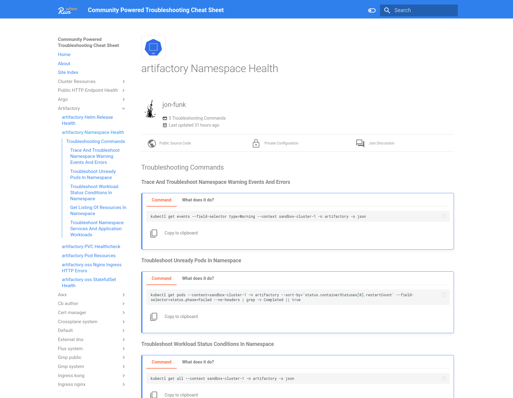

# Running Locally


The following steps allow you to safely run RunWhen from your own laptop, with the ability to inspect all generated configuration files and command list documentation without the need to interact with the RunWhen API.



If you have any issues with this process, have a look at [**Generating Service Accounts and Kubeconfigs**](https://docs.runwhen.com/public/runwhen-platform/guides/kubernetes-environments/generating-service-accounts-and-kubeconfigs), or feel free to reach out on [Slack](https://runwhen.slack.com/join/shared\_invite/zt-1l7t3tdzl-IzB8gXDsWtHkT8C5nufm2A), [GitHub](https://github.com/runwhen-contrib/runwhen-local) or [Discord](https://discord.com/invite/Ut7Ws4rm8Q)


### Pull the RunWhen Local Container Image

The RunWhen Local container image might take a little time to download. Start by pulling the image while you move on to the next steps in a separate terminal.



```
docker pull ghcr.io/runwhen-contrib/runwhen-local:latest
```



```
docker pull --platform=linux/arm64 ghcr.io/runwhen-contrib/runwhen-local:latest
```



```
# Pull the image
podman pull ghcr.io/runwhen-contrib/runwhen-local:latest
```



<pre><code># Pull the image
<strong>podman pull --platform=linux/arm64 ghcr.io/runwhen-contrib/runwhen-local:latestpodman pull --platform=linux/arm64 ghcr.io/runwhen-contrib/runwhen-local:latest
</strong></code></pre>



### Prepare a Working Directory

* Create the working directory: _**changing this path as desired**_

```
# Set your preferred runwhen-local working directory 
export workdir=~/runwhen-local
```

The working directory is used to share files with the map builder container, while also provide a path for the container write its output.

* Create a **workspaceInfo.yaml** file, and an **output directory**
* The **output directory** is set with **open permissions** so that the container can write the output to it - there is no sensitive data (such as secrets/kubeconfigs/etc) in the _output folder_


The **output directory** is shared so that you can easily review the generated configuration files without needing to exec into the container.

If using Podman with macOS, make sure`$workdir/output` resides in `/Users`.



All keys with the value **placeholder** are required, but the value can be left as `placeholder` (they are only used when uploading content to the RunWhen platform for AI assisted troubleshooting)




```
mkdir -p $workdir/shared/output

# Set the output directory to 777 so that the runwhen container user can write 
# out the configuraiton files: 
chmod -R 777 $workdir/shared

cat <<EOF > $workdir/shared/workspaceInfo.yaml
workspaceName: my-workspace
# All content with [placeholder] is only updated
# and auto-generated when using the RunWhen Platform
# leave it as [placeholder] if only using RunWhen Local
# See https://docs.runwhen.com/public/v/runwhen-local/user-guide/user_guide-advanced_configuration
workspaceOwnerEmail: tester@my-company.com
defaultLocation: placeholder
defaultLOD: 2
namespaceLODs:
  kube-system: 0
  kube-public: 0
  kube-node-lease: 0
custom:
  kubernetes_distribution: Kubernetes
  kubernetes_distribution_binary: kubectl
  
  # Possible values are gcp, aws, none
  cloud_provider: gcp
  
  # Possible values are gmp, promql, none
  prometheus_provider: gmp

  # If using GCP and wanting to use GCP integrations  
  gcp_project_id: placeholder 
  
  # Secret names are used when integrating the RunWhen Platform
  # with your enviornment. RunWhen has no access to this data, 
  # as the secret name and content comes from your own configuration. 
  kubeconfig_secret_name: kubeconfig
  gcp_ops_suite_sa: ops-suite-sa
EOF
chmod 655 $workdir/shared/workspaceInfo.yaml
```



```
mkdir -p ~/runwhen-local/shared/output

# The ouput directory needs to be written to from the container image: 
chmod 777 ~/runwhen-local/shared/output

cat <<EOF > ~/runwhen-local/shared/workspaceInfo.yaml
workspaceName: my-workspace
# Tokens are generated from the RunWhen Platform UI if 
# planning on uploading workspace configuration
workspaceOwnerEmail: tester@my-company.com
defaultLocation: [placeholder]
defaultLOD: 2
namespaceLODs:
  kube-system: 0
  kube-public: 0
  kube-node-lease: 0
custom:
  kubernetes_distribution: OpenShift
  kubernetes_distribution_binary: oc
  
  # Possible values are gcp, aws
  # cloud_provider: gcp
  
  # Possible values are gmp, promql
  prometheus_provider: gmp
  # If using GCP and wanting to use GCP integrations  
  # gcp_project_id: [gcp-project-id] 
  
  # Secret names are used when integrating the RunWhen Platform
  # with your enviornment. RunWhen has no access to this data, 
  # as the secret name and content comes from your own configuration. 
  kubeconfig_secret_name: kubeconfig
  # gcp_ops_suite_sa: ops-suite-sa
EOF
```




Everything in the workspaceInfo.yaml file that has a \[placeholder] beside it is not required for RunWhen Local to function . They are required when uploading configurations to the RunWhen Platform and are generated automatically when needed.


### Generating your Kubeconfig

RunWhen Local needs a [kubeconfig](https://kubernetes.io/docs/concepts/configuration/organize-cluster-access-kubeconfig/) that provides access to your cluster to discover resources.

The good thing is, if you've regularly used a Kubernetes cluster, you most likely have a kubeconfig. We just need to get it ready for RunWhen Local. The following script will help create a new version, or you can craft your own.




These step uses [**yq**](https://github.com/mikefarah/yq) and [**jq**](https://jqlang.github.io/jq/) to create a new kubeconfig for RunWhen Local to use. See the [yq install documentation](https://github.com/mikefarah/yq#install) to obtain the tool. It currently supports creating a kubeconfig with a short lived token for GKE and OKE clusters.



This script _will not modify your existing kubeconfig._ It will copy the contents (defaulted from \~/.kube/config) into a file that is usable by RunWhen Local. It is still on your local machine and safe to use.


* Fetch the _gen\_rw\_kubeconfig.sh_ from [GitHub](../deploy/scripts/gen\_rw\_kubeconfig.sh)

<pre><code>
<strong>curl -o- https://raw.githubusercontent.com/runwhen-contrib/runwhen-local/main/deploy/scripts/gen_rw_kubeconfig.sh > gen_rw_kubeconfig.sh
</strong>
</code></pre>

* Run the script to generate the kubeconfig

```
# Set executable permissions on the script
chmod +x gen_rw_kubeconfig.sh

# Run the script
./gen_rw_kubeconfig.sh
```


If temporary tokens are generated through this process (such as with GKE or OKE), rerun the script as needed once the tokens expire




If you already have a service account in your cluster, or wish to use a service account with a standard kubeconfig, see [Generating Service Accounts and Kubeconfigs](https://docs.runwhen.com/public/runwhen-platform/guides/kubernetes-environments/generating-service-accounts-and-kubeconfigs) and come back here when you're done!

Based on how you created the kubeconfig in the above step, you will want to copy it to `~/runwhen-local/shared/kubeconfig`

```
cp ${newFile} ~/$workdir/shared/kubeconfig
```



###

### Generating your Cheat Sheet

With the working directory in place, there are two more steps to generate the your troubleshooting cheat sheet:

* Run the container image


Run this command within the same terminal that was used to prepare $workdir.




```
docker run --name RunWhenLocal -p 8081:8081 -v $workdir/shared:/shared -d ghcr.io/runwhen-contrib/runwhen-local:latest
```



```
# Run the container image
podman run --name RunWhenLocal -p 8081:8081 -v $workdir/shared:/shared  --userns=keep-id:uid=999,gid=999 ghcr.io/runwhen-contrib/runwhen-local:latest
```



```
# Run the container image
podman run --platform=linux/arm64 --name RunWhenLocal -p 8081:8081 -v $workdir/shared:/shared  --userns=keep-id:uid=999,gid=999 ghcr.io/runwhen-contrib/runwhen-local:latest
```



* Execute the script to perform discovery and build documentation:



```
docker exec -w /workspace-builder -- RunWhenLocal ./run.sh
```



```
podman exec -w /workspace-builder -- RunWhenLocal ./run.sh
```




Depending on the amount of resources to in your cluster(s), the discovery process may take a few minutes to complete.


### Viewing the Troubleshooting Cheat Sheet

When the process has completed, you can navigate to [http://localhost:8081](http://localhost:8081) to view the troubleshooting commands generated for your environment.

<figure><figcaption></figcaption></figure>

### Cleanup

* Cleaning up the running container and image



<pre><code><strong>docker kill RunWhenLocal; docker rm RunWhenLocal
</strong></code></pre>



```
podman kill RunWhenLocal; podman rm RunWhenLocal
```


