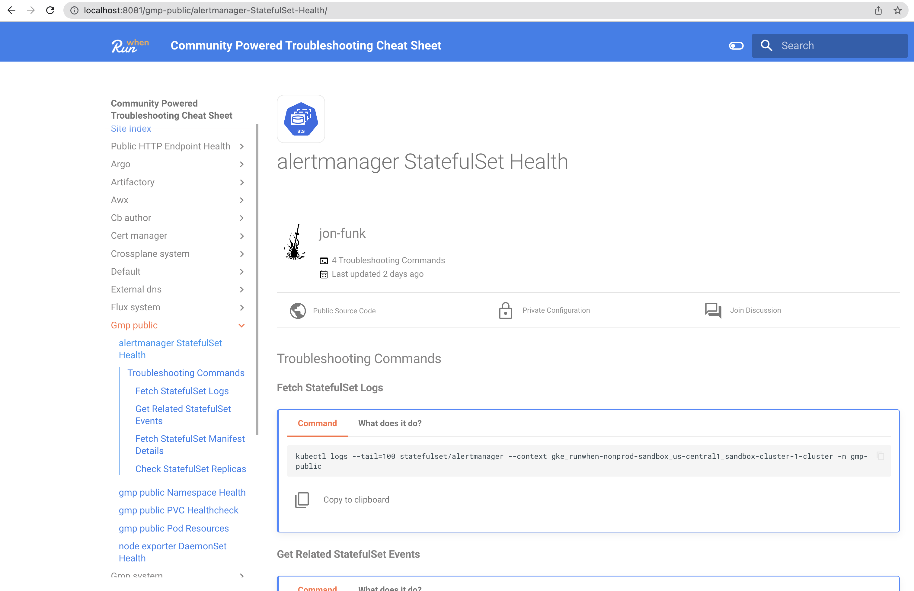

# Running in Kubernetes


If you have any issues with this process, feel free to reach out on [Slack](https://runwhen.slack.com/join/shared\_invite/zt-1l7t3tdzl-IzB8gXDsWtHkT8C5nufm2A) or [GitHub](https://github.com/runwhen-contrib/runwhen-local) or [Discord](https://discord.com/invite/Ut7Ws4rm8Q)


## Overview

Some teams might benefit from running a single instance of RunWhen Local directly from a Kubernetes cluster, sharing copy & paste-able troubleshooting commands with an entire team.


The commands generated in the Troubleshooting Cheat Sheet include the specific kubeconfig context. In order for this tool to be of the greatest use to all users, each user should have their kubeconfig context set to the identical name as the one that is used to generate the cheat sheet.


As we also host this in Kubernetes for the purposes of an online demo, this document will share the manifests that we have used in [our own demo environment](https://runwhen-local.sandbox.runwhen.com).




RunWhen Local requires access to a kubeconfig in order to perform resource discovery across Kubernetes clusters. When installing with Helm, RunWhen Local _can automatically discover it's local cluster by default_. To discover additional clusters, a separate kubeconfig secret is required. Please see [helm-configuration.md](user-guide/user\_guide-advanced\_configuration/helm-configuration.md "mention")for additional information. \
\
For additional resources on creating a long-lived service account and Kubeconfig, please see [**Generating Service Accounts and Kubeconfigs**](https://docs.runwhen.com/public/runwhen-platform/guides/kubernetes-environments/generating-service-accounts-and-kubeconfigs).


#### Installing the RunWhen Local Helm Chart

<pre><code># Customize the namespace name and path to kubeconfig as desired
namespace=runwhen-local

# Create the namespace
<strong>kubectl create ns $namespace
</strong>
# Add the RunWhen Conrib Helm Chart Repo
helm repo add runwhen-contrib https://runwhen-contrib.github.io/helm-charts
helm repo update

# Install the RunWhen Local helm release 
helm install runwhen-local runwhen-contrib/runwhen-local -n $namespace
</code></pre>




RunWhen Local requires access to a _kubeconfig_ to perform resource discovery across Kubernetes clusters. This secret should have read permissions on the namespaces and resource types that you would like discovered \
\
For additional resources on creating a long-lived service account and Kubeconfig, please see [**Generating Service Accounts and Kubeconfigs**](https://docs.runwhen.com/public/runwhen-platform/guides/kubernetes-environments/generating-service-accounts-and-kubeconfigs).


#### Kubernetes Manifests

Deploying RunWhen Local to a Kubernetes cluster can be achieved with the following manifests:

* Deployment:
  * Supports an environment variable titled `AUTORUN_WORKSPACE_BUILDER_INTERVAL` to control how often the Troubleshooting Cheat Sheet content is refreshed
  * Defines the following volumes to mount into the container:
    * configmap-volume: mounts the workspaceInto.yaml file into the container
    * kubeconfig: mounts the kubeconfig secret into the container
* Service
  * A standard service will suffice to provide access to any running replicas. If not using an ingress object to expose the application outside of the cluster, users can use `kubectl port-forward` to access the RunWhen application through the service.
* Ingress
  * The ingress object supports access from outside of the cluster to the RunWhen conatiner. An example ingress manifest is not provided, as this will vary from cluster to cluster.
* ConfigMap
  * Stores the `workspaceInfo.yaml` file, which is the main configuration file that is used to customize how RunWhen Local builds it's Troubleshooting Cheat Sheet. See [user\_guide-advanced\_configuration](user-guide/user\_guide-advanced\_configuration/ "mention")for more details on how to modify this file.
* Secret
  * A kubeconfig secret that contains all contexts that should be included in the Troubleshooting Cheat Sheet. This is typically a user or service account that has view-only access to the resources you wish to be included in the Troubleshooting Cheat Sheet.

Example deployment manifests (as used in the online demo environment) are in the [runwhen-local GitHub repo](https://github.com/runwhen-contrib/runwhen-local/tree/main/deploy/kubernetes). There is an all-in-one.yaml manifest that provides the fastest path to deployment.

####

### Deploying the manifests

In order to use the all-in-one.yaml manifest to deploy RunWhen Local to your Kubernetes cluster:

```
# Customize the namespace name and path to kubeconfig as desired
namespace=runwhen-local
kubeconfig_path=~/runwhen-local/shared/kubeconfig

# Create the namespace
kubectl create ns $namespace

# Create the kubeconfig secret
kubectl create secret generic runwhen-local-kubeconfig --from-file=kubeconfig=$kubeconfig_path -n $namespace

# Create the deployment, service, and configmap
kubectl apply -f https://raw.githubusercontent.com/runwhen-contrib/runwhen-local/main/deploy/kubernetes/all-in-one.yaml -n $namespace
```


It might take a few minutes for discovery to complete. In some cases, the API server isn't available right away when the discovery attempts to start and this may delay the initial scan until the `AUTORUN_WORKSPACE_BUILDER_INTERVAL` has passed.




<details>

<summary>Advanced Helm Deployment - EKS Fargate</summary>

EKS Fargate only looks at Kubernetes resource requests when provisioning nodes. As a result, the following helm installation command is recommended for EKS Fargate implementations:&#x20;


```
helm install runwhen-local runwhen-contrib/runwhen-local \
    -n $namespace \
    --set resources.requests.memory="1Gi" \
    --set resources.requests.cpu="1" 
```


</details>

<details>

<summary>Advanced Helm Deployment - Ingress Deployment</summary>

While the ingress configuration will vary between environments, the following _example_ outlines how to create an ingress object with the helm installation command.&#x20;

_This example demonstrates an ingress object ingress-nginx, cert-manager, and external-dns._ &#x20;

```
namespace=rwl-2
hostname="rwl.sandbox.runwhen.com"
helm install runwhen-local runwhen-contrib/runwhen-local -n $namespace \
    --set ingress.enabled=true \
    --set ingress.annotations."kubernetes\.io/tls-acme"=letsencrypt-prod \
    --set-string ingress.annotations."cert-manager\.io/cluster-issuer"="true"\
	--set ingress.annotations."external-dns\.alpha\.kubernetes\.io/hostname"=${hostname} \
    --set ingress.className="ingress-nginx" \
  	--set ingress.hosts[0].host=${hostname} \
  	--set ingress.hosts[0].paths[0].backend.service.name="runwhen-local" \
  	--set ingress.hosts[0].paths[0].backend.service.port.number=8081 \
  	--set ingress.hosts[0].paths[0].path="/" \
  	--set ingress.hosts[0].paths[0].pathType="Prefix" \
  	--set ingress.tls[0].hosts[0]=${hostname} \
  	--set ingress.tls[0].secretName="runwhen-local-tls"
```

</details>

#### Testing the RunWhen Local Deployment

If you choose to deploy an ingress object (or loadbalancer type service) with an accessible URL or dedicated IP address, you can simply navigate to that URL to validate the functionality.

Without an ingress object or loadbalancer IP address, you can port-forward the instance to your local machine:

```
kubectl port-forward svc/runwhen-local 8081:8081 -n $namespace
```

With the service available on your local machine, you can access the interface by opening a browser to [http://localhost:8081](http://localhost:8081)

<figure><figcaption></figcaption></figure>
