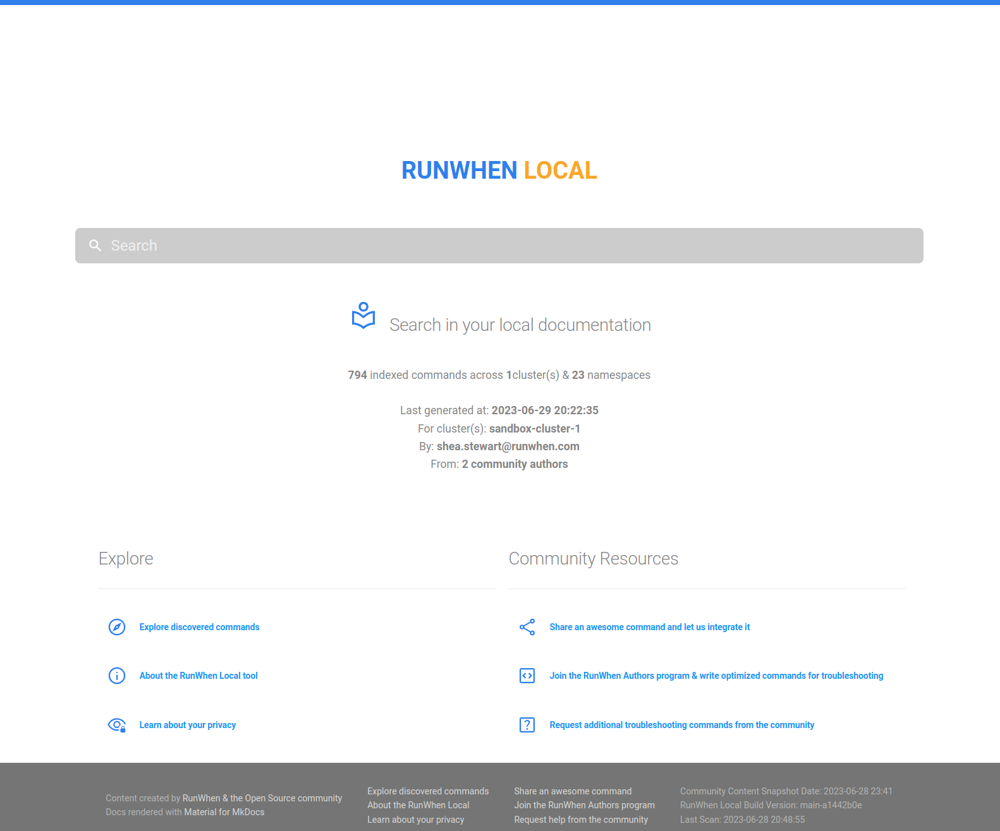
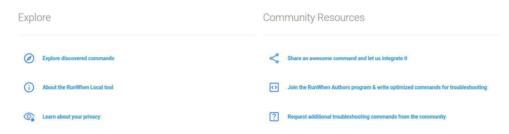
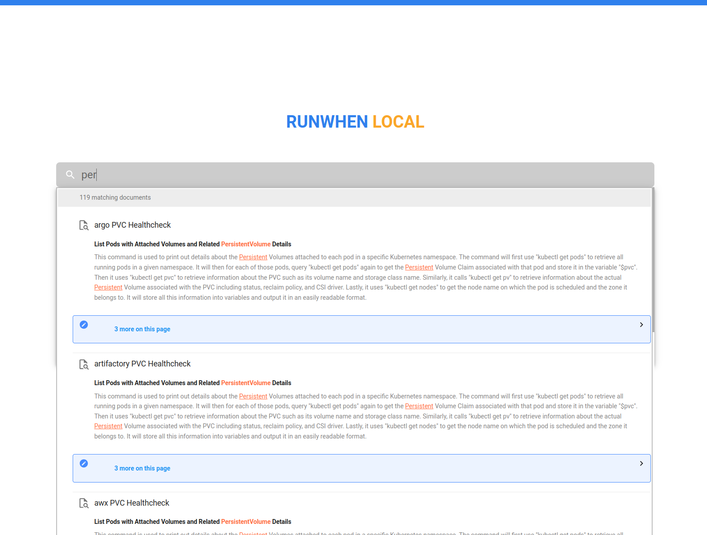
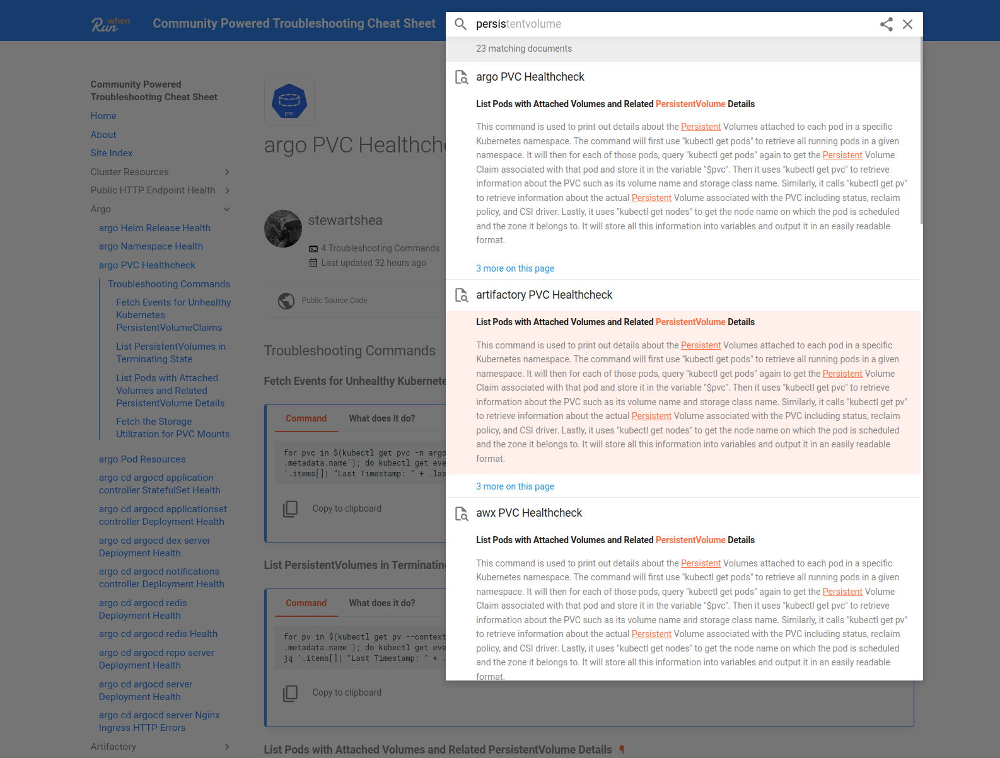
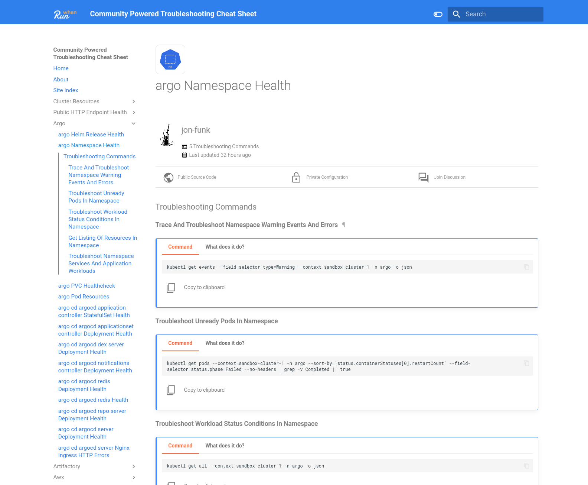
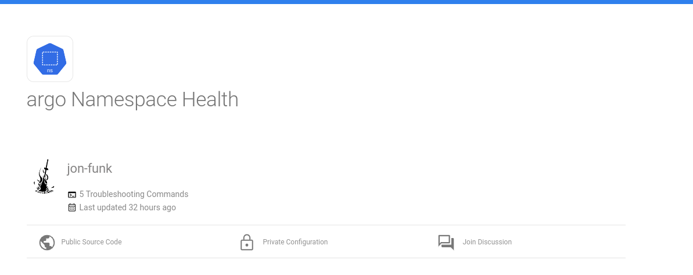
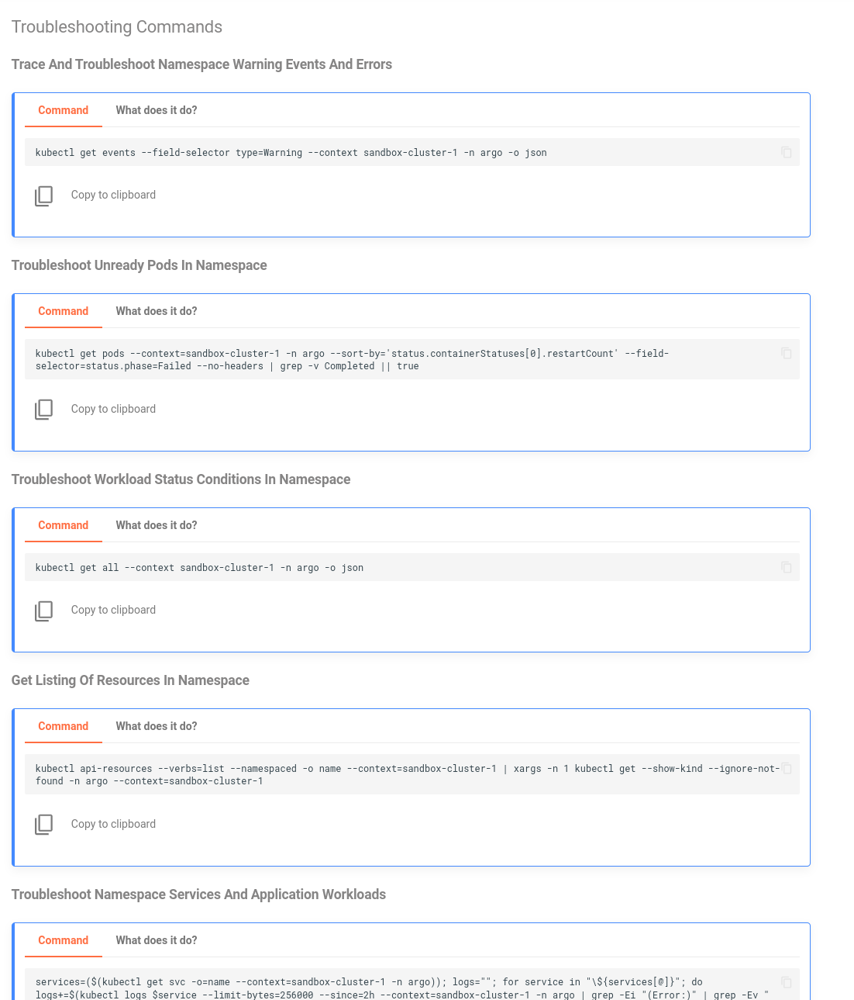

# Feature Overview

## Your Troubleshooting Home Page

When discovery is complete, the RunWhen Local home page provides a main search bar to help you find useful troubleshooting commands, along with some details about the discovery process, such as:

* The number of commands generated
* The number of clusters scanned
* How many community authors wrote the troubleshooting commands
* Who ran the discovery process

<figure><figcaption>
RunWhen Local Home Page
</figcaption></figure>

###

#### Home Page Quick Links

Within the home page, you will also notice some quick links that will allow you to easily navigate through your tailored troubleshooting commands, or interact with the open source community.

<figure><figcaption>
Home Page Quick Links
</figcaption></figure>

####

## Searching for Content

Search bars are everywhere! The home page sports a large search bar to help find the right troubleshooting command. There is also a search bar in the top right corner of every page - you can input items such as the name of your application, namespace, or a particular type of resource you are trying to troubleshoot.

<figure><figcaption>
Home Page Search Bar
</figcaption></figure>

<figure><figcaption>
In-Page Search Bar
</figcaption></figure>

## Command Details

Each page is generated based on a particular resource that was discovered and combines troubleshooting commands from the open source community that best match the resource.

<figure><figcaption>
Example List of Troiubleshooting Commands for the Argo Namespace
</figcaption></figure>

### Links/Resources

At the top of this page, we see a few additional resources to learn more about the commands, such as:

* The GitHub user that authored the commands
* How many troubleshooting commands the page includes
* The last time the troubleshooting command source code was updated
* The links to the (open source) troubleshooting source code
* The link to view the \*private\* configuration, which tailors the commands to make them copy/paste ready but is never shared outside of your container
* A link to GitHub Discussions to engage with the community about the commands found on this page

<figure><figcaption>
Example Page Hearder with Communtiy Resources
</figcaption></figure>

### Commands

The list of commands in a copy & paste format, ready to be used in your terminal:

<figure><figcaption></figcaption></figure>

### Explanations

If you want to understand what each command does, click the **What does it do? tab** to display documentation about the command. All documentation is statically generated and stored with the public source code of the command and does not have access to, or context of, your resource names, namespace names, and so on. These explanations are generic and do not share any of your resource details with RunWhen.

### Running Commands from the Terminal


The built in terminal provides **unauthenticated access** to the container, with access to tools like `kubectl`. This feature should be disabled ([terminal-configuration.md](user-guide/user\_guide-advanced\_configuration/terminal-configuration.md "mention")) if running in a shared cluster - or the service account permissions thoroughly reviewed.&#x20;


A simple terminal has been added to the RunWhen Local application in order to provide a quicker way to run commands from within the same window. The terminal has command line tools like `kubectl` installed, and is configured to use the same KUBECONFIG that was used to discover cluster resources.&#x20;

<figure><figcaption>
Running Commands in the Terminal
</figcaption></figure>

## Feedback 

This tool get's better with feedback and contributions from a growing community. If you are passionte about sharing your best troubleshooting commands or finding other commands that suit your needs, please consider sharing your experience in any of the following avenues:

* [Fill out a very short feedback form](https://docs.google.com/forms/d/e/1FAIpQLScuso8SQMdj9d-0VnxxBMcvdZrcZ2M389EbwE355flnkQOUFQ/viewform)
* [Open up a GitHub issue](https://github.com/runwhen-contrib/runwhen-local/issues/new/choose)
  * Ask for help
  * Contribute a command
  * Provide any other ideas or issues
* [Join our GitHub Discussions](https://github.com/orgs/runwhen-contrib/discussions)
