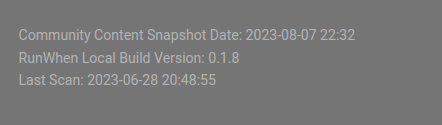

# Release Notes

All code has been migrated to the GitHub repository. Please see the [**RunWhen Local GitHub Releases** ](https://github.com/runwhen-contrib/runwhen-local/releases)page for details on each release.

## Version Details

RunWhen Local currently provides the following version details in the footer of the local documentation site:

<figure><figcaption>
Version information
</figcaption></figure>

* Community Content Snapshot Date: This is the date that the container image is built, which includes any updated rules that match community content with discovered resources.
* RunWhen Local Build Version: This is the image tag used during the build process.
* Last Scan: This is the timestamp that `run.sh` was executed, your environment was scanned, and troubleshooting content was generated.
