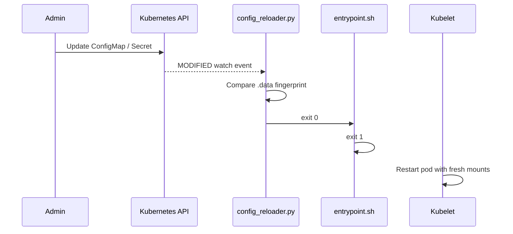

# Kubernetes Config Reload

When RunWhen Local runs in Kubernetes with continuous discovery enabled
(`AUTORUN_WORKSPACE_BUILDER_INTERVAL`), it automatically **restarts the pod**
when a mounted ConfigMap or Secret changes. No external reloader (for example
Stakater Reloader) is required.

## Why a pod restart is required

The RunWhen Local Helm chart mounts configuration with **subPath** volume
mounts:

```yaml
volumeMounts:
  - name: configmap-volume
    mountPath: /shared/workspaceInfo.yaml
    subPath: workspaceInfo.yaml
  - name: upload-secret-volume
    mountPath: /shared/uploadInfo.yaml
    subPath: uploadInfo.yaml
```

Kubernetes **never updates subPath mounts in-place**. After you
`kubectl apply` a ConfigMap or Secret change, the file inside the running pod
stays stale until the pod is recreated.

The config reloader watches the **source objects** in the Kubernetes API and
triggers a controlled pod restart.

## How it works



On startup the entrypoint launches `config_reloader.py` as a background
process when:

- `AUTORUN_WORKSPACE_BUILDER_INTERVAL` is set, and
- `RW_CONFIG_RELOAD_ENABLED` is `auto` (default) and the pod has an in-cluster
  service account token.

The reloader:

1. Reads the pod's own `spec.volumes` to discover mounted ConfigMaps and
   Secrets (including extras from `runwhenLocal.volumes` in Helm values).
2. Records a SHA-256 fingerprint of each object's `.data` field.
3. Opens parallel Kubernetes watch streams (or polls, if configured).
4. Exits when any watched object's data changes.

The entrypoint detects the reloader exit, logs the event, and terminates with
exit code `1`. The Deployment controller starts a new pod, which mounts the
updated ConfigMap/Secret content.

## What is watched automatically

Any ConfigMap or Secret referenced as a pod volume is watched, including:

| Mount | Typical source |
| ----- | -------------- |
| `/shared/workspaceInfo.yaml` | `runwhenLocal.workspaceInfo` ConfigMap |
| `/shared/uploadInfo.yaml` | `runwhenLocal.uploadInfo` Secret |
| `/shared/kubeconfig` | `runwhenLocal.discoveryKubeconfig` Secret |
| `/shared/gcp.secret`, `/shared/aws.secret`, … | Extra `runwhenLocal.volumes` / `volumeMounts` |

EmptyDir volumes (`/shared/output`, `/tmp`) and script-generated files
(`kubeconfig` written at runtime) are **not** watched.

## Environment variables

| Variable | Default | Description |
| -------- | ------- | ----------- |
| `RW_CONFIG_RELOAD_ENABLED` | `auto` | `auto` = enable in-cluster only; `true` = force on; `false` = disable |
| `RW_WATCH_CONFIGMAPS` | _(none)_ | Extra ConfigMaps to watch (colon-separated), merged with auto-discovery |
| `RW_WATCH_SECRETS` | _(none)_ | Extra Secrets to watch (colon-separated), merged with auto-discovery |
| `RW_CONFIG_RELOAD_EXCLUDE` | _(none)_ | ConfigMaps/Secrets to exclude from auto-discovery (colon-separated) |
| `RW_CONFIG_RELOAD_MODE` | `watch` | `watch` = API watch streams; `poll` = periodic fingerprint polling |
| `RW_CONFIG_RELOAD_POLL_INTERVAL` | `30` | Seconds between polls when `RW_CONFIG_RELOAD_MODE=poll` |
| `RW_CONFIG_RELOAD_WATCH_TIMEOUT` | `300` | Watch stream timeout before reconnect (seconds) |
| `RW_CONFIG_RELOAD_NAMESPACE` | _(pod ns)_ | Override namespace for watch API calls |
| `RW_CONFIG_RELOAD_CHECK_INTERVAL` | `5` | Seconds between reloader checks while discovery runs |

When a change is detected, the reloader signals the entrypoint (`SIGUSR1`) so the
pod restarts immediately—even if a long discovery run is still in progress.

### Helm example: exclude a proxy CA secret

Proxy CA bundles rarely change and do not affect discovery. Exclude them to
avoid unnecessary restarts:

```yaml
runwhenLocal:
  extraEnv:
    RW_CONFIG_RELOAD_EXCLUDE: "proxy-ca-tls"
```

### Helm example: watch a Secret not mounted as a volume

If a credential Secret is referenced only by path inside `workspaceInfo.yaml`
but mounted via a custom volume, auto-discovery picks it up. For Secrets that
are **not** pod volumes, add them explicitly:

```yaml
runwhenLocal:
  extraEnv:
    RW_WATCH_SECRETS: "external-database-creds"
```

### Disable auto-reload

```yaml
runwhenLocal:
  extraEnv:
    RW_CONFIG_RELOAD_ENABLED: "false"
```

Use this only when you manage restarts yourself (for example after every
`helm upgrade` or `kubectl apply`).

## RBAC requirements

The workspace-builder ServiceAccount needs:

| Resource | Verbs | Purpose |
| -------- | ----- | ------- |
| `pods` | `get` | Read own pod spec to discover volume sources |
| `configmaps` | `get`, `list`, `watch` | Watch mounted ConfigMaps |
| `secrets` | `get`, `list`, `watch` | Watch mounted Secrets |

The default Helm chart enables `runwhenLocal.serviceAccountRoles.clusterRoleView`,
which grants these permissions via the built-in `view` ClusterRole.

If you use a restricted custom Role, ensure the above verbs are present in the
release namespace.

## Verify it is working

After the pod starts, look for log lines like:

```
Starting Kubernetes config reloader (watches mounted ConfigMaps/Secrets)...
2025-06-24 ... INFO Watching 1 ConfigMap(s) and 2 Secret(s) in namespace runwhen-local
2025-06-24 ... INFO   - configmap/workspaceinfo
2025-06-24 ... INFO   - secret/uploadinfo
2025-06-24 ... INFO   - secret/gcp-credentials
```

To test, update a watched ConfigMap:

```bash
kubectl edit configmap workspaceinfo -n runwhen-local
# change a value, save, and exit
kubectl get pods -n runwhen-local -w
```

Within a few seconds you should see:

```
ConfigMap/Secret change detected — exiting for pod restart
```

The pod restarts and the new `workspaceInfo.yaml` content is visible inside
the container.

## Troubleshooting

### Config reloader does not start

**Symptoms:** No "Starting Kubernetes config reloader" line in logs.

**Checks:**

1. `AUTORUN_WORKSPACE_BUILDER_INTERVAL` must be set (Helm `autoRun.discoveryInterval` sets this automatically).
2. `RW_CONFIG_RELOAD_ENABLED` must not be `false`.
3. The container must run in-cluster (service account token at `/var/run/secrets/kubernetes.io/serviceaccount/token`).

### Pod does not restart after ConfigMap change

**Symptoms:** Reloader logs a change but the pod keeps running.

**Checks:**

1. Confirm you see `ConfigMap/Secret change detected — exiting for pod restart` in logs. If only the Python reloader logs a change, you may be on an older image that waited for discovery to finish before restarting.
2. Confirm the ConfigMap is actually mounted as a pod volume (not only referenced in YAML text).
3. Check reloader logs for RBAC errors (`Forbidden`, `cannot list/watch`).
4. Try poll mode as a fallback:
   ```yaml
   runwhenLocal:
     extraEnv:
       RW_CONFIG_RELOAD_MODE: "poll"
       RW_CONFIG_RELOAD_POLL_INTERVAL: "15"
   ```
5. Verify the Deployment has `restartPolicy: Always` (default for Deployments).

### Reloader exits unexpectedly

**Symptoms:** `Config reloader exited unexpectedly (code N); continuing without auto-reload`

**Checks:**

1. Exit code `2` usually means no watch targets were found — check volume mounts.
2. API connectivity issues — verify network policies allow access to the Kubernetes API.
3. Re-enable after fixing root cause; the entrypoint continues discovery without auto-reload until the pod is restarted cleanly.

### Docker / local deployments

The config reloader runs only in-cluster. For Docker or bind-mount setups with
`AUTORUN_WORKSPACE_BUILDER_INTERVAL`, discovery re-runs on the configured
interval only. Restart the container after changing `workspaceInfo.yaml` or
credential files under `/shared`.

## Related

- [Helm configuration](./helm.md) — chart values and volume mounts
- [`workspaceInfo.yaml` reference](./workspace-info.md)
- Source: [`src/config_reloader.py`](../../../src/config_reloader.py),
  [`src/entrypoint.sh`](../../../src/entrypoint.sh)
