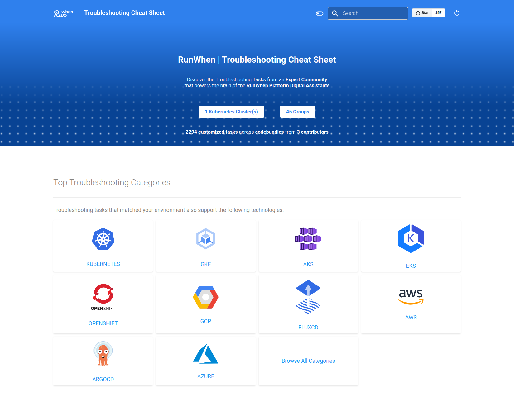

# Runner (Agent)


The Runner installation is disabled by default and is not required with RunWhen Local unless also using the RunWhen Platform.&#x20;


The Runner is an agent that is deployed within your infrastructure that runs and executes [CodeBundles](https://docs.runwhen.com/public/runwhen-platform/feature-overview/code-bundles)   (managed and controlled by the RunWhen Platform).&#x20;

### Runner Installation

The Runner is installed with the RunWhen Local helm chart by setting `runner.enabled=true`. For example:&#x20;

```
# Customize the namespace name and path to kubeconfig as desired
namespace=runwhen-local
workspace=[my-runwhen-workspace]

# Create the namespace
kubectl create ns $namespace

# Add the RunWhen Conrib Helm Chart Repo
helm repo add runwhen-contrib https://runwhen-contrib.github.io/helm-charts
helm repo update

# Install the RunWhen Local helm release 
helm install runwhen-local runwhen-contrib/runwhen-local --set workspaceName=$workspace --set runner.enabled=true -n $namespace
```

&#x20;Please see [this link ](https://github.com/runwhen-contrib/helm-charts/blob/9fe6a5e778201e530f49e2ddc804206ec551a272/charts/runwhen-local/values.yaml#L186)for the runner specific helm chart values.

The Runner installation of at least 3 pods:&#x20;

* runner (the main control point for communicating with the RunWhen Platform)
* metrics pods (used for sending SLI and Task metric data to the RunWhen Platform)
  * grafana-agent
  * pushgateway
* Additional pods (with a UUID naming convention) that are created and removed as needed. These pods execute the SLI and Taslk CodeBundles as instructed from the RunWhen platform.&#x20;

### Generating and Applying the Runner Registration Token

After the Helm Chart Installation, a few pods will be pending, as they will be waiting for registration token to exist.&#x20;

* Navigate to your **RunWhen Workspace -> Settings -> Workspace -> Admin Tools**

<figure><figcaption></figcaption></figure>

* Select **Create a Runner Registration Token** and provide a useful name for your runner location

<figure><figcaption></figcaption></figure>

* Copy the provided token, and create a secret named **runner-registration-token**

```
kubectl create secret generic runner-registration-token --from-literal=token="[TOKEN]" -n $namespace
```

* The Runner pod should now register with the platform, fetch all necessary secrets, and all three runner pods (push-gateway, runner, grafana-agent) should be in a running state


