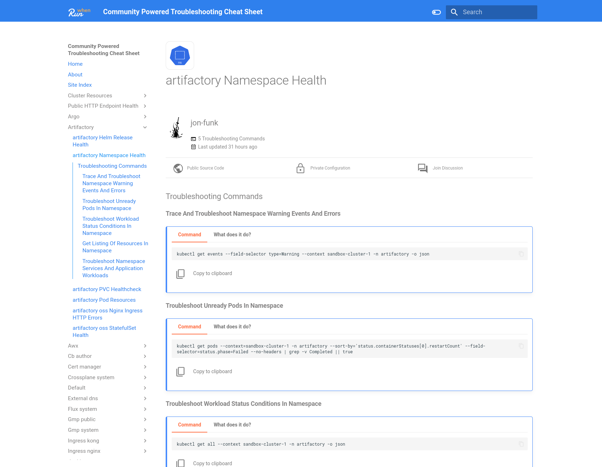

# Docker/Podman - Without RunWhen Platform


The following steps allow you to safely run RunWhen from your own laptop (with docker/podman), with the ability to inspect all generated configuration files and command list documentation without the need to interact with the RunWhen API.



If you have any issues with this process, have a look at [**Generating Service Accounts and Kubeconfigs**](https://docs.runwhen.com/public/runwhen-platform/guides/kubernetes-environments/generating-service-accounts-and-kubeconfigs), or feel free to reach out on [Slack](https://runwhen.slack.com/join/shared\_invite/zt-1l7t3tdzl-IzB8gXDsWtHkT8C5nufm2A), [GitHub](https://github.com/runwhen-contrib/runwhen-local) or [Discord](https://discord.com/invite/Ut7Ws4rm8Q)


### Pull the RunWhen Local Container Image

The RunWhen Local container image might take a little time to download. Start by pulling the image while you move on to the next steps in a separate terminal.



```
docker pull ghcr.io/runwhen-contrib/runwhen-local:latest
```



```
docker pull --platform=linux/arm64 ghcr.io/runwhen-contrib/runwhen-local:latest
```



```
# Pull the image
podman pull ghcr.io/runwhen-contrib/runwhen-local:latest
```



<pre><code># Pull the image
<strong>podman pull --platform=linux/arm64 ghcr.io/runwhen-contrib/runwhen-local:latestpodman pull --platform=linux/arm64 ghcr.io/runwhen-contrib/runwhen-local:latest
</strong></code></pre>



### Prepare a Working Directory

* Create the working directory: _**changing this path as desired**_

```
# Set your preferred runwhen-local working directory 
export workdir=~/runwhen-local
```

The working directory is used to share files with the map builder container, while also provide a path for the container write its output.

* Create a **workspaceInfo.yaml** file, and an **output directory**
* The **output directory** is set with **open permissions** so that the container can write the output to it - there is no sensitive data (such as secrets/kubeconfigs/etc) in the _output folder_


The **output directory** is shared so that you can easily review the generated configuration files without needing to exec into the container.

If using Podman with macOS, make sure`$workdir/output` resides in `/Users`.




```
mkdir -p $workdir/shared/output

# Set the output directory to 777 so that the runwhen container user can write 
# out the configuration files: 
chmod -R 777 $workdir/shared

cat <<EOF > $workdir/shared/workspaceInfo.yaml
defaultLocation: none
workspaceOwnerEmail: tester@my-company.com
# More workspace config
# Default Level of Detail(LOD): none, basic, or detailed
# https://docs.runwhen.com/public/v/runwhen-local/user-guide/user_guide-advanced_configuration/workspaceinfo-customization/level-of-detail
defaultLOD: detailed
cloudConfig:
  kubernetes:
    kubeconfigFile: /shared/kubeconfig
    namespaceLODs:
      kube-system: 0
      kube-public: 0
      kube-node-lease: 0
codeCollections: []
custom:
  # Note: Most of these are simple keys, such as the name of a secret that
  # should be referenced from the platform. The secret itself (key and value)
  # must be created in the RunWhen Platform by the user. We do not upload
  # or configure secrets automatically.
  # The default for kubeconfig_secret_name is set to a secret that runwhenLocal
  # creates for the use of the runner. This can be simply swapped out with the
  # name of a secret that is stored in the RunWhen Platform.
  kubeconfig_secret_name: kubeconfig
  kubernetes_distribution_binary: kubectl
EOF
chmod 655 $workdir/shared/workspaceInfo.yaml
```



```
mkdir -p $workdir/shared/output

# The output directory needs to be written to from the container image: 
chmod 777 $workdir/shared/output

cat <<EOF > $workdir/shared/workspaceInfo.yaml
defaultLocation: none
workspaceOwnerEmail: tester@my-company.com
# More workspace config
# Default Level of Detail(LOD): none, basic, or detailed
# https://docs.runwhen.com/public/v/runwhen-local/user-guide/user_guide-advanced_configuration/workspaceinfo-customization/level-of-detail
defaultLOD: detailed
cloudConfig:
  kubernetes:
    kubeconfigFile: /shared/kubeconfig
    namespaceLODs:
      kube-system: 0
      kube-public: 0
      kube-node-lease: 0
codeCollections: []
custom:
  # Note: Most of these are simple keys, such as the name of a secret that
  # should be referenced from the platform. The secret itself (key and value)
  # must be created in the RunWhen Platform by the user. We do not upload
  # or configure secrets automatically.
  # The default for kubeconfig_secret_name is set to a secret that runwhenLocal
  # creates for the use of the runner. This can be simply swapped out with the
  # name of a secret that is stored in the RunWhen Platform.
  kubeconfig_secret_name: kubeconfig
  kubernetes_distribution_binary: kubectl
EOF
```




Everything in the workspaceInfo.yaml file that has a \[placeholder] beside it is not required for RunWhen Local to perform discovery or render the Troubleshooting Cheat Sheet. These values are required, however, when [uploading](../features/upload-to-runwhen-platform.md) configurations to the RunWhen Platform (and are generated automatically when this activity is performed).


### Generating your Kubeconfig

RunWhen Local needs a [kubeconfig](https://kubernetes.io/docs/concepts/configuration/organize-cluster-access-kubeconfig/) that provides access to your cluster to discover resources.

The good thing is, if you've regularly used a Kubernetes cluster, you most likely have a kubeconfig. We just need to get it ready for RunWhen Local. The following script will help create a new version, or you can craft your own.




These step uses [**yq**](https://github.com/mikefarah/yq) and [**jq**](https://jqlang.github.io/jq/) to create a new kubeconfig for RunWhen Local to use. See the [yq install documentation](https://github.com/mikefarah/yq#install) to obtain the tool. It currently supports creating a kubeconfig with a short lived token for GKE and OKE clusters.



This script _will not modify your existing kubeconfig._ It will copy the contents (defaulted from \~/.kube/config, but also supports KUBECONFIG) into a file that is usable by RunWhen Local. It is still on your local machine and safe to use.


* Fetch the _gen\_rw\_kubeconfig.sh_ from [GitHub](../../../deploy/scripts/gen\_rw\_kubeconfig.sh)

<pre><code>
<strong>curl -o- https://raw.githubusercontent.com/runwhen-contrib/runwhen-local/main/deploy/scripts/gen_rw_kubeconfig.sh > gen_rw_kubeconfig.sh
</strong>
</code></pre>

* Run the script to generate the kubeconfig

```
# Set executable permissions on the script
chmod +x gen_rw_kubeconfig.sh

# Run the script
./gen_rw_kubeconfig.sh
```


If temporary tokens are generated through this process (such as with GKE, OKE, or azure cli), rerun the script as needed once the tokens expire




If you already have a service account in your cluster, or wish to use a service account with a standard kubeconfig, see [Generating Service Accounts and Kubeconfigs](https://docs.runwhen.com/public/runwhen-platform/guides/kubernetes-environments/generating-service-accounts-and-kubeconfigs) and come back here when you're done!

Based on how you created the kubeconfig in the above step, you will want to copy it to `$workdir/shared/kubeconfig`

```
cp ${newFile} $workdir/shared/kubeconfig
```



###

### Generating your Cheat Sheet

With the working directory in place, there are two more steps to generate the your troubleshooting cheat sheet:

* Run the container image


Run this command within the same terminal that was used to prepare $workdir.





```
docker run --name RunWhenLocal -p 8081:8081 -v $workdir/shared:/shared -d ghcr.io/runwhen-contrib/runwhen-local:latest
```





```
# Run the container image
podman run --name RunWhenLocal -p 8081:8081 -v $workdir/shared:/shared  --userns=keep-id:uid=999,gid=999 ghcr.io/runwhen-contrib/runwhen-local:latest
```





```
# Run the container image
podman run --platform=linux/arm64 --name RunWhenLocal -p 8081:8081 -v $workdir/shared:/shared  --userns=keep-id:uid=999,gid=999 ghcr.io/runwhen-contrib/runwhen-local:latest
```





With SELinux enabled, adding "--security-opt label=disable" can get things going quickly so to prevent access denied errors when the pod tries to access the shared volume mount.



```
# Run the container image
podman run --platform=linux/arm64 --name RunWhenLocal -p 8081:8081 -v $workdir/shared:/shared --security-opt label=disable --userns=keep-id:uid=999,gid=999 ghcr.io/runwhen-contrib/runwhen-local:latest
```




* Execute the script to perform discovery and build documentation:



```
docker exec -w /workspace-builder -- RunWhenLocal ./run.sh
```



```
podman exec -w /workspace-builder -- RunWhenLocal ./run.sh
```




Depending on the amount of resources to in your cluster(s), the discovery process may take a few minutes to complete.


### Viewing the Troubleshooting Cheat Sheet

When the process has completed, you can navigate to [http://localhost:8081](http://localhost:8081) to view the troubleshooting commands generated for your environment.

<figure><figcaption></figcaption></figure>

###

### Optional: Add a CLI Shortcut

If you would like a shortcut from the CLI to open your cheatsheet, the following may help:



* **Open Terminal**: This can usually be found in your applications or by searching.
* **Edit the Bash Profile**:
  * For **Linux**, you'll typically edit the `.bashrc` file. For **macOS**, you'll edit the `.bash_profile` or `.zshrc` if you're using zsh.
  * Use a text editor like nano or vim. For example, type `nano ~/.bashrc` (Linux) or `nano ~/.bash_profile` (macOS) and press Enter.
* **Add the Alias**:
  *   At the end of the file, add the following line:

      ```bash
      alias runwhen-local='open http://127.0.0.1:8081 &>/dev/null &'
      ```
  * For macOS, `open` is the command to open the URL in your default browser. For Linux, you might need to use `xdg-open` instead of `open`.
* **Save and Exit**:
  * For nano, press `CTRL + X`, then `Y` to confirm, and `Enter` to exit.
  * For vim, press `Esc`, type `:wq`, and press `Enter`.
* **Activate the Alias**:
  * To make the alias available, you need to reload the profile. Type `source ~/.bashrc` (Linux) or `source ~/.bash_profile` (macOS) and press Enter.
* **Test the Alias**:
  * Simply type `runwhen-local` in your terminal and press Enter. It should open your default browser to the specified website.



* **Check if a Profile Already Exists**:
  * In PowerShell, type `Test-Path $PROFILE` and press Enter. If it returns `True`, then you already have a profile.
* **Create or Edit the Profile**:
  * If you don't have a profile, create one by typing `New-Item -path $PROFILE -type file -force`.
  * Open the profile in a text editor, such as Notepad, by typing `notepad $PROFILE`.
* **Add the Function and Alias to Your Profile**:
  *   Add the following lines to the profile script:

      ```powershell
      function Open-RunWhenLocal { Start-Process "http://127.0.0.1:8081" }
      Set-Alias -Name runwhen-local Open-RunWhenLocal
      ```
  * Save and close the file.
* **Reload Your Profile** (or restart PowerShell):
  * Type `. $PROFILE` to reload your profile in the current session.
* **Test the Alias Again**:
  * Type `runwhen-local` and press Enter. It should open your default browser to the specified website.



### Cleanup

* Cleaning up the running container and image



<pre><code><strong>docker kill RunWhenLocal; docker rm RunWhenLocal
</strong></code></pre>



```
podman kill RunWhenLocal; podman rm RunWhenLocal
```



### Next Steps

If you're using RunWhen Local as way of building your [**RunWhen Platform**](https://docs.runwhen.com/public/runwhen-platform/getting-started-with-runwhen-platform) workspace, jump to [upload-to-runwhen-platform.md](../features/upload-to-runwhen-platform.md "mention")to complete this process.
